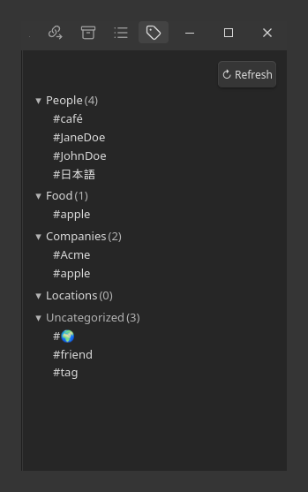
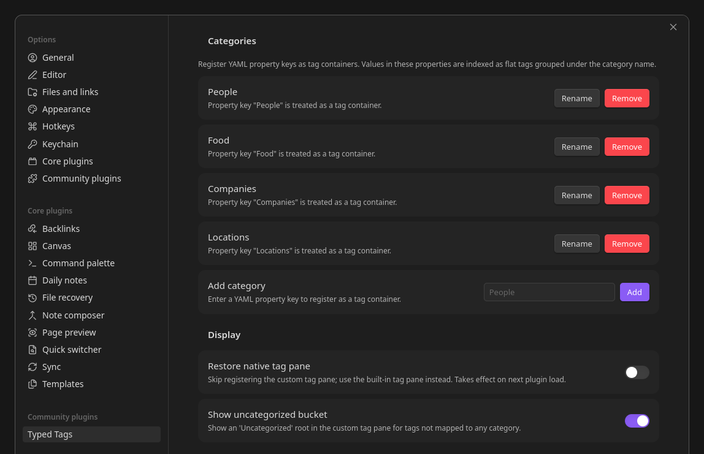
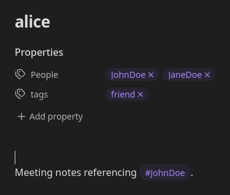

# Typed Tags

Declare YAML property keys as **tag containers**. Flat aesthetic tags stay `#clean` in your prose while being grouped under user-defined categories in a custom tag pane.

<p align="center">
  
</p>

## Why

Obsidian funnels every tag into one global pool. Nested tags (`#people/JohnDoe`) categorize them but look ugly in prose. List-valued YAML properties (`People: [JohnDoe]`) look clean but lose the native tag UX (pill rendering, click-to-search, autocomplete) and break Dataview / Tasks / Tag Wrangler / Graph View.

Typed Tags resolves the tradeoff:

- Designate any YAML key (e.g., `People`, `Locations`, `Projects`) as a **tag container**.
- Values render as tag pills with autocomplete and click-to-search.
- Flat tags (`#JohnDoe`) remain visible to Obsidian's metadata cache and downstream plugins.
- The Tag Pane is replaced with a custom view grouping tags under category roots.

## Install

Until the plugin lands in the Obsidian community directory, install manually:

1. Copy `manifest.json`, `main.js`, and `styles.css` into `<your-vault>/.obsidian/plugins/obsidian-typed-tags/`.
2. In Obsidian → Settings → Community plugins, enable **Typed Tags**.

## Use

### Declare a category

In **Settings → Typed Tags → Categories**, add the YAML key you want to use as a tag container. You can add as many as you like and rename or remove them later.

<p align="center">
  
</p>

### Tag a note

In any note's frontmatter, fill the registered keys:

```yaml
---
People:
  - JohnDoe
  - JaneDoe
tags:
  - friend
---
```

`People` renders as tag pills in the Properties panel — visually identical to the native `tags` row, but distinct (no merging). Each pill is clickable and runs the same `tag:#name` search the native tags do.

<p align="center">
  
</p>

`#JohnDoe` is now a tag visible to Dataview (`list from #JohnDoe`), the Graph View, and any plugin reading `app.metadataCache`.

### Browse by category

Open the **Typed Tags** pane from the sidebar. Categories are root folders, tags are leaves underneath, and an **Uncategorized** bucket collects every tag that's not in a typed property. A `↻ Refresh` button rebuilds the index on demand.

A tag that belongs to multiple categories (e.g. `apple` in both `Food` and `Companies`) appears under each — that's intentional, not a bug.

### Rename a category

Click **Rename** next to a category in Settings. A small modal asks for the new key, then a second modal previews every change before any file is rewritten:

- Notes scanned, notes that will change, collisions
- The first ten diffs (`- People: ...` / `+ Contacts: ...`)
- Cancel or **Rewrite N notes**

The actual rewrite uses Obsidian's `Vault.process` so concurrent edits are CAS-safe. If a note already contains both keys (collision), it's left untouched so no data is lost.

## Settings

| Setting | Effect |
| --- | --- |
| **Restore native tag pane** | Skips the custom pane; uses Obsidian's built-in tag pane. Takes effect on next plugin load. |
| **Show uncategorized bucket** | When off, tags not mapped to any category are hidden from the pane. |

## Limitations (v1)

- **No automatic categorization.** You assign tags to categories explicitly via the YAML key they live under.
- **No bulk tag migration UI** beyond the category-rename flow.
- **No sync conflict resolution.** The plugin trusts Obsidian Sync / Git / iCloud to deliver eventually-consistent frontmatter.
- **No per-category styling** (colors, icons). One default style.
- **Mobile compatibility is best-effort.** Desktop is the primary target.
- **Source mode shows raw YAML.** Pill rendering is in Live Preview, Reading View, and the Properties panel only.
- **Category rename collisions** — when a note already has both `People` and `Contacts` keys, the rename of `People → Contacts` skips that file (no destructive merge). Resolve manually.

## Data model

- **Frontmatter is the source of truth.** Each note's typed-property values are the authoritative mapping `tag → category` for that note.
- **`data.json` caches a derived index** (`forward: category → tags`, `reverse: tag → categories`) for cold-start speed. The cache is regenerable; on any mismatch with frontmatter, the frontmatter wins.
- **Category definitions live in `data.json`** (the list of registered keys + your settings). They are not derivable from notes alone.

## Compatibility

- **Dataview / Tasks / Tag Wrangler / Graph View** — all see flat tags from typed properties as if they were native tags. The plugin patches `metadataCache.getFileCache` / `getCache` (and `getTags` if present) at read time to inject typed-property values into `frontmatter.tags`. **No file is ever rewritten** to achieve this.
- **Obsidian Sync** — the rename migration uses `Vault.process` for atomic, CAS-safe rewrites. Concurrent edits are replayed safely.

## Uninstall

Disable the plugin. Every patch is reverted, the custom Tag Pane is detached, and the native Tag Pane comes back. Your notes' frontmatter is unchanged.

## Development

```
npm install
npm run dev      # build + watch with inline source maps
npm run build    # one-shot production build
npm test         # vitest unit tests
npm run lint     # eslint
npm run seed     # populate test-vault/seed/ for manual integration
```

Symlink the plugin into the test vault once:

```
ln -sfn "$(pwd)" test-vault/.obsidian/plugins/typed-tags
```

## License

MIT — see `LICENSE`.
